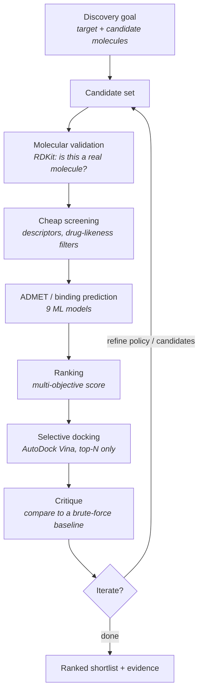
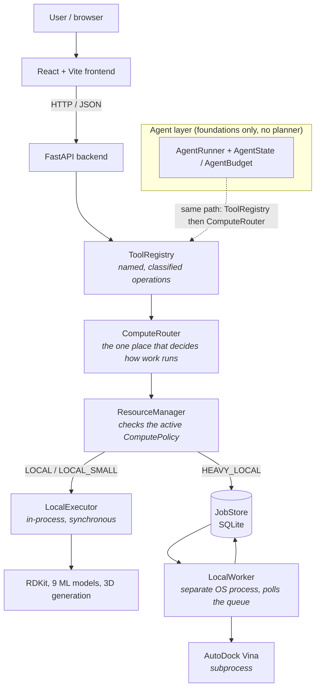

# DrugForge

**Agentic drug discovery: cheap screening narrows the field, expensive docking runs only on what survives.**

DrugForge is a computational drug-discovery workbench. It is being extended into
a compute-aware platform for agent-driven molecular discovery. It combines a
React frontend, a FastAPI backend, RDKit cheminformatics, machine-learning
property and ADMET prediction, real AutoDock Vina docking, and an asynchronous
execution layer that keeps expensive work off the request path. The execution
layer already works. The agent layer on top of it is, so far, a set of data
structures and a deterministic tool-calling loop.

<p>


</p>

> **Status.** A working prediction, visualisation, and docking tool. An
> asynchronous compute layer that is implemented and tested. A computational
> funnel that has been built and evaluated. The data structures and the
> deterministic loop that an agent will eventually use. There is no autonomous
> agent, no LLM planner, and no candidate generation yet. Every claim below is
> marked with where it stands.

| Legend | Meaning |
|---|---|
| ✅ Implemented | In the codebase and exercised by tests or manual use |
| 🧪 Experimental | Built and evaluated as a research question; results and limits documented |
| 🚧 In development | Partially built. The foundations exist; the behaviour does not |
| 📋 Planned | Designed for, not started |

---

## Table of contents

1. [What is DrugForge?](#what-is-drugforge)
2. [Why DrugForge? The bottleneck](#why-drugforge-the-bottleneck)
3. [The core idea](#the-core-idea)
4. [What can DrugForge do today?](#what-can-drugforge-do-today)
5. [A beginner's guide to the science](#a-beginners-guide-to-the-science)
6. [How DrugForge works](#how-drugforge-works)
7. [Frontend architecture](#frontend-architecture)
8. [Backend architecture](#backend-architecture)
9. [The compute fabric](#the-compute-fabric)
10. [Jobs and workers](#jobs-and-workers)
11. [AutoDock Vina and docking](#autodock-vina-and-docking)
12. [Machine learning and ADMET](#machine-learning-and-admet)
13. [The computational funnel](#the-computational-funnel-experimental)
14. [The agent direction](#the-agent-direction)
15. [API reference](#api-reference)
16. [Project structure](#project-structure)
17. [Tech stack](#tech-stack)
18. [Local installation](#local-installation)
19. [First run](#first-run)
20. [API examples](#api-examples)
21. [Performance and resource control](#performance-and-resource-control)
22. [Testing](#testing)
23. [Deployment](#deployment)
24. [Limitations and scientific disclaimer](#limitations-and-scientific-disclaimer)
25. [Roadmap](#roadmap)
26. [Contributing](#contributing)
27. [License](#license)
28. [Acknowledgements](#acknowledgements)
29. [Project summary](#project-summary)

---

## What is DrugForge?

DrugForge is a software platform for computational exploration of drug-like
molecules.

Finding a new drug starts with an enormous number of candidate molecules and a
tiny number worth taking further. Before anyone touches a lab, chemists use
software to estimate, cheaply and approximately, which molecules are even
plausible. DrugForge brings several of those methods together behind one
interface.

Given a molecule (written as a short text string called SMILES), DrugForge can:

- check it is chemically valid and compute basic properties (molecular weight,
  lipophilicity, polar surface area, and so on);
- predict ADMET-related properties (solubility, blood-brain barrier
  permeability, CYP3A4 inhibition, toxicity signals, plasma half-life) using
  machine-learning models trained on public datasets;
- predict target-related activity, for example a probability that the molecule
  inhibits COX-2 or binds ACE2, again with ML models;
- run real molecular docking with AutoDock Vina, which physically fits the
  molecule into a protein's binding pocket and returns a score and 3D poses;
- render the molecule in 2D and 3D in the browser.

Everything DrugForge produces is a computational prediction or a prioritisation
signal. It is not experimental proof and not medical advice. See
[the scientific disclaimer](#limitations-and-scientific-disclaimer).

---

## Why DrugForge? The bottleneck

The people this is for are computational chemists, or a small discovery team
screening a library of molecules against one protein target. They already have a
scoring method they trust (physics-based docking), and they cannot afford to run
it on everything.

On the hardware most teams actually have (a workstation or a single cloud box,
not a cluster), docking one molecule well takes tens of seconds to minutes, and
running it several times with different random seeds for reliability multiplies
that. A few hundred molecules is an overnight job; a few thousand is a week.

The question is not how to dock faster. Vina is Vina. The question is which
slice of the library to spend the docking budget on, and how much gets lost by
not docking the rest.

The naive approach spends everything up front:

```
1,000 candidates  ->  1,000 expensive docking jobs
```

The compute-aware approach spends cheap computation first and expensive
computation last, on far fewer molecules:

```
1,000 candidates
    |
    v  validation           (milliseconds each)
    v  cheap ML prediction  (milliseconds each)
    v  filtering + ranking
    v
  ~50 promising candidates
    |
    v  selective docking    (minutes each, but only 50 of them)
```

This idea shows up in two places in the repository: the compute fabric (the
execution layer that makes "cheap in-process, expensive queued" a real
distinction) and the computational funnel (a concrete, evaluated implementation
of the narrowing pipeline above).

---

## The core idea



Step by step, in plain terms:

| Step | What happens | Cost |
|---|---|---|
| Candidate generation | You supply a set of molecules (today a CSV; 📋 future: an agent proposes them). | n/a |
| Molecular validation | RDKit parses each SMILES string. Anything it cannot turn into a sane molecule is dropped. | cheap |
| Cheap screening | Physicochemical descriptors are computed; molecules far outside drug-like ranges (very heavy, very greasy, too many H-bond donors) are filtered out. | cheap |
| ADMET / binding prediction | The 9 trained models score each survivor for solubility, toxicity, permeability, target activity, and so on. | cheap |
| Ranking | A single tunable formula combines those scores into one number per molecule. | cheap |
| Selective docking | Only the top-N ranked molecules are docked with AutoDock Vina, the expensive step. | expensive |
| Critique | The funnel's shortlist is compared against a brute-force run that docked everything, so you can measure what the shortcut missed. | cheap (offline) |
| Iterate | Adjust the ranking policy or the candidate set and repeat. | n/a |

---

## What can DrugForge do today?

| Feature | What it does | Technology | Status |
|---|---|---|---|
| SMILES validation | Parse and sanitise a molecule string; reject invalid input | RDKit | ✅ |
| Molecular descriptors | 10 physicochemical properties (MW, LogP, TPSA, H-bond donors/acceptors, rotatable bonds, ring counts, Fsp3) | RDKit | ✅ |
| Morgan fingerprints | ECFP4 bit vectors (radius 2, 1024 bits); the ML feature representation | RDKit | ✅ |
| 3D coordinate generation | SMILES to embedded 3D conformer plus Gasteiger charges plus pharmacophore features | RDKit (ETKDGv3, MMFF) | ✅ |
| 2D / 3D visualisation | In-browser molecule rendering and docked-pose viewing | RDKit.js (WASM), 3Dmol.js | ✅ |
| ADMET / property prediction | Solubility, BBB permeability, CYP3A4 inhibition, toxicity, HepG2 toxicity, plasma half-life | scikit-learn RandomForest | ✅ |
| Target activity prediction | COX-2 inhibition probability, ACE2 binding probability, a generic drug-target binding score | scikit-learn RandomForest | ✅ |
| Batch prediction | Run every model over a list of molecules in one request, with a hard size cap | FastAPI + compute fabric | ✅ |
| Molecular docking | Real AutoDock Vina: SMILES, ligand prep, dock into a receptor, affinity and poses | AutoDock Vina 1.2.7 CLI, Meeko | ✅ |
| Deterministic docking | Every Vina run pins seed, thread count, exhaustiveness; full provenance stored per job | vina_env + docking_worker | ✅ |
| Asynchronous docking jobs | `/start` returns immediately; a separate worker process executes; poll for status | JobStore (SQLite) + LocalWorker | ✅ |
| Job status / history / cancellation | Track queued, running, completed, failed, cancelled jobs; cross-process cancel | JobStore + `os.kill` on worker PID | ✅ |
| Resource control | Per-mode limits on docking, concurrency, and batch size, enforced by the backend | ResourceManager + ComputePolicy | ✅ |
| Compute modes | `battery-saver` / `balanced` / `performance`, switchable at runtime | `/api/compute/mode` | ✅ |
| AI chat assistant | Context-aware Q&A about the molecule on screen (server-side key, provider-abstracted) | Google Gemini (`google-genai`) | ✅ |
| Tool registry | Every scientific operation registered as a named, compute-classified tool | `tools/registry.py` | ✅ |
| Agent foundations | Budget, run-state, tool-call audit types, plus a deterministic tool-calling loop | `agents/` | 🚧 |
| Computational funnel | Cheap-screen, rank, dock-top-N pipeline, plus a brute-force baseline and an evaluation harness | `funnel/` | 🧪 |
| Agent planner / autonomy | An LLM deciding what to do next | n/a | 📋 |
| Candidate generation | Proposing new molecules | n/a | 📋 |
| Remote / GPU workers | Executing heavy jobs off-box | interface only | 📋 |

---

## A beginner's guide to the science

You do not need chemistry or machine-learning background to follow the rest of
this document. Here are the terms DrugForge uses, each with a one-line
definition and why it appears here.

| Term | Simple definition | Why DrugForge uses it |
|---|---|---|
| Molecule | A specific arrangement of atoms and bonds; a candidate drug. | The unit of everything here. |
| SMILES | A compact text encoding of a molecule, e.g. `CC(=O)Oc1ccccc1C(=O)O` is aspirin. | The input format for every endpoint; easy to type, store, and pass around. |
| Molecular descriptor | A single computed number summarising one property (weight, greasiness, polar area, and so on). | Cheap "is this even drug-like?" filtering before anything expensive. |
| Molecular fingerprint | A fixed-length bit vector where each bit marks the presence of a small substructure. DrugForge uses Morgan / ECFP4, 1024 bits. | The numeric input the ML models were trained on. |
| ADMET | Absorption, Distribution, Metabolism, Excretion, Toxicity: how the body handles a drug. Most candidates fail on ADMET rather than on potency. | Several models predict ADMET-related endpoints so weak candidates are dropped early. |
| Target | The protein a drug is meant to act on (here COX-2, an inflammation enzyme, and ACE2, a receptor). | Docking and the target models are all "against a target". |
| Ligand | The small molecule that binds to the target (as opposed to the protein itself). | In docking, your candidate is the ligand. |
| Molecular docking | A physics-based search that tries to fit a ligand into a protein's pocket and scores how well it fits. | The expensive, trusted scoring method the whole funnel is built around. |
| Docking pose | One predicted 3D placement of the ligand in the pocket. Vina returns several, best first. | Shown in the 3D viewer; stored with each job. |
| Docking score / affinity | Vina's estimate of binding strength in kcal/mol; more negative means predicted tighter binding. | Used to rank candidates. It is not a measured binding constant and not proof of biological activity. |
| Binding prediction (ML) | A model's guess at binding strength from a fingerprint alone, with no 3D structure. | A cheap pre-screen signal. DrugForge's `binding_score` model emits a pKd-like number (higher = stronger), on a different scale from Vina's kcal/mol. |
| Exhaustiveness / seed | Vina settings: how hard it searches, and the random starting point. Different seeds give slightly different scores. | DrugForge pins both so a stored score is reproducible. |

---

## How DrugForge works



The layers, top to bottom:

- **Frontend.** A single-page React app. It never talks to models, databases, or
  Vina directly; it only makes HTTP calls to the backend.
- **FastAPI backend.** The HTTP gateway. Route handlers do almost no work
  themselves; they look a tool up in the registry and hand it to the router.
- **ToolRegistry.** A name-addressable catalogue of every scientific operation
  (`parse_smiles`, `calculate_descriptors`, `predict_solubility`, and so on
  through `run_docking`). Each entry carries a compute class describing how
  expensive it is.
- **ComputeRouter.** The single decision point. Given a tool, it asks the
  ResourceManager whether the call is allowed right now, then dispatches: cheap
  tools run in-process; heavy tools become a queued job.
- **ResourceManager and ComputePolicy.** These enforce the active compute mode's
  limits (is docking enabled, how many concurrent docks, how big a batch). The
  limits are server-side and authoritative. The frontend can request a mode but
  cannot set arbitrary limits.
- **LocalExecutor.** Runs cheap tools immediately, behind a small concurrency
  semaphore. This is the same path predictions always took; the wrapper only
  adds the gate.
- **JobStore (SQLite).** Persists heavy-job records so they survive an API
  restart.
- **LocalWorker.** A separate operating-system process that polls the job queue
  and runs Vina. Because it is a different process, a slow dock never blocks the
  API.
- **Agent layer.** `AgentRunner` exists and is tested, but only executes a fixed
  list of tool calls a caller hands it. It uses the same
  `ToolRegistry` then `ComputeRouter` path. No planner drives it yet.

---

## Frontend architecture

**Stack:** React 19, Vite 7, React Router 7, TanStack Query 5, Tailwind CSS 4,
Framer Motion, RDKit.js (WASM), 3Dmol.js, Axios.

The UI was consolidated from 20-plus legacy routes down to five core screens
(`src/App.jsx`), all lazy-loaded:

| Route | Screen | Purpose |
|---|---|---|
| `/` | Landing page | Public marketing / entry |
| `/app` | Dashboard | System status, compute-mode control, model health |
| `/app/analyze` | Lab Bench | Enter one molecule, run predictions, inspect properties (replaces the old per-model pages) |
| `/app/batch` | Batch Processor | Upload or paste many SMILES, run all models |
| `/app/docking` | Docking Studio | Submit and monitor Vina docking jobs, view poses |
| `/app/visualization` | Molecular Visualization | Standalone 2D/3D viewer |
| `/app/settings` | User Settings | Local preferences |

**Visualisation is a separate bundle.** RDKit.js and 3Dmol.js are large
WebAssembly and rendering libraries. Bundling them into the landing page would
make first load slow for visitors who never open a molecule. Instead each heavy
screen is a lazily-imported chunk (`React.lazy` plus `Suspense`), and Vite
splits vendor code (`react`, `react-dom`) and utility code (`axios`,
`react-markdown`, `framer-motion`) into their own chunks (`vite.config.js`). A
decorative-animation "performance mode" (`VITE_PERFORMANCE_MODE`) can quiet the
background effects on weaker machines without touching the molecule viewers.

Server state is fetched with TanStack Query. `src/hooks/useModelHealth.js` is
the reference pattern (fetch, cache, loading/error). App state lives in two React
Context providers (`AuthContext`, `DrugForgeContext`).

Authentication is a client-side mock. `AuthContext` validates an email format and
a 6-character password entirely in the browser and stores a fake token in
`localStorage`; the backend's `/auth/*` endpoints are stubs that return 401/501.
There is no real user system. The sign-in screen is a gate you click through, not
a security boundary.

The API base URL comes from `VITE_API_URL` (default `http://localhost:5001`,
`src/services/api.js`).

---

## Backend architecture

**Stack:** FastAPI, Uvicorn, Pydantic v2, RDKit, scikit-learn, NumPy, joblib,
Meeko, `google-genai`, `httpx`. Python 3.11. Run from inside `backend/app/` as
`uvicorn main:app`.

```
backend/app/
├── main.py            # app wiring: CORS, lifespan (model loading), router registration,
│                      # /health, /models, the 4 global singletons
├── routers/           # one HTTP module per endpoint group (predictions, batch,
│                      # utils, chat, dock, compute)
├── schemas/           # Pydantic request/response models (molecule, prediction, docking)
├── services/          # db_service (Supabase REST, optional) + llm/ (provider-abstracted chat)
├── utils/             # rdkit_helper (features/descriptors), model_loader, vina_env
├── compute/           # policy, resource_manager, router, local_executor
├── tools/             # registry, the named-tool catalogue
├── jobs/              # models, store (SQLite), workers/ (base, local_worker, docking_worker)
├── agents/            # types (budget/state/tool-call), runner (deterministic loop)
└── funnel/            # the computational-funnel experiment (see its own section)
```

The organising principle is a hard split between two kinds of work:

| | Lightweight, synchronous | Heavy, asynchronous |
|---|---|---|
| Examples | SMILES validation, descriptors, all 9 model inferences, 3D generation, small batches | AutoDock Vina docking |
| Where it runs | in the API process, in-request | in a separate worker process, via a queued job |
| Response | the actual result, immediately | a `task_id` you poll |
| Typical time | under 100 ms | tens of seconds to minutes |
| Gate | batch-size limit | docking enabled? concurrency slot free? |

Route handlers do not decide which bucket they are in. They name a tool and the
ComputeRouter decides from the tool's compute class.

On startup (`lifespan`), the app loads all available `.pkl` models into memory
once, logs the active compute mode, and checks optional Supabase connectivity.
Supabase is optional: if it is not configured, predictions still work; the app
just does not persist a history row.

---

## The compute fabric

This is the layer that turns "cheap in-process, expensive queued" from a
convention into an enforced architecture. It lives in `backend/app/compute/` and
`backend/app/jobs/`, and it is implemented and tested.

```
Any caller  (a route handler today, an AgentRunner later)
    |
    v
ToolRegistry.get("run_docking")        # look the tool up by name
    |
    v
ComputeRouter.execute(tool, ...)       # the one decision point
    |
    v
ResourceManager.can_run(tool, class)   # allowed under the active ComputePolicy?
    |
    +-- denied  -> raise ComputeRejected -> HTTP 413 / 503
    |
    +-- allowed, LOCAL / LOCAL_SMALL -> LocalExecutor.run(tool)    # in-process, returns the result
    |
    +-- allowed, HEAVY_LOCAL         -> JobStore.create_job(...)   # returns a queued Job record
```

### The pieces

| Component | File | Responsibility |
|---|---|---|
| ToolRegistry | `tools/registry.py` | A dict of `Tool(name, category, description, fn, compute_class)`. `build_default_registry()` wraps the existing functions; it duplicates no science. |
| ComputeClass | `compute/policy.py` | `LOCAL`, `LOCAL_SMALL`, `HEAVY_LOCAL`, `REMOTE_CAPABLE`. Set once per tool. |
| ComputePolicy | `compute/policy.py` | The limit set for the running process, built from `COMPUTE_MODE` plus env overrides. Frozen dataclass. |
| ResourceManager | `compute/resource_manager.py` | `can_run()` returns allowed or denied plus a human-readable reason. Reads the live docking-job count from JobStore via an injected callback. |
| ComputeRouter | `compute/router.py` | `execute()` checks the ResourceManager, then dispatches to LocalExecutor or JobStore. Raises `ComputeRejected` on denial. |
| LocalExecutor | `compute/local_executor.py` | Runs a cheap tool now, behind an `asyncio.Semaphore` sized to `max_local_jobs`. |
| JobStore | `jobs/store.py` | SQLite-backed persistence of `Job` records; async wrappers over stdlib `sqlite3`. |
| LocalWorker | `jobs/workers/local_worker.py` | Separate process; polls, claims, and runs heavy jobs. |

### Why this exists

- It prevents uncontrolled CPU use on the developer's machine. A fanless laptop
  cannot survive 50 concurrent Vina processes; the policy caps it.
- It keeps the API responsive. Heavy work is a queued job in another process, so
  the event loop is never blocked. Measured during hardening: with a heavy job
  running, 16 API requests each returned in under about 25 ms.
- It centralises compute policy. There is exactly one place that decides how
  something runs, with no `if docking:` branches scattered through route
  handlers.
- It leaves room for other backends. `jobs/workers/base.py` defines a `Worker`
  interface; `LocalWorker` is the only implementation. A `RemoteWorker` or
  `GPUWorker` would slot in without changing callers. No such worker exists yet.
- The agent will use the same seam. A planner's tool calls go through the
  identical `ToolRegistry.get()` then `ComputeRouter.execute()` path.

---

## Jobs and workers

A `Job` (`jobs/models.py`) is the generic unit of asynchronous work: docking
today, and any future `HEAVY_LOCAL` tool later. Its fields: `id, type, status,
priority, input, output, error, created_at, started_at, completed_at,
worker_id, worker_pid, retry_count`.

### Lifecycle

```
POST /api/dock/start
    |
    v
 queued  -->  running  -->  completed        (affinity, poses, and full provenance in output)
               |
               +-->  failed      (Vina error, timeout, or missing binary; a real error, never a fake score)
               +-->  cancelled   (POST /api/dock/cancel/{id} kills the subprocess via its PID)

queued  -> running:    a LocalWorker claims the job
running -> completed:   the Vina subprocess finishes
```

A dock exceeding `DOCKING_TIMEOUT_SECONDS` (default 600) is killed and marked
`failed`. On worker startup, any job still `running` past that timeout is
presumed dead and marked `failed` (zombie-row cleanup, not distributed fault
tolerance). For cancellation, the worker writes its Vina subprocess PID into the
job row, so a `/cancel` request arriving at the API process can kill that PID
directly.

### SQLite is the job store, today

`JobStore` writes to `backend/app/jobs/jobs.db` using Python's stdlib `sqlite3`.
That adds no dependency, survives restarts, and works offline. It was chosen over
the project's optional Supabase integration so the system runs with no paid
infrastructure. It does not touch the Supabase `predictions` table.

### Future job-store backends 📋

`JobStore` is the only place SQLite is touched. A `PostgresJobStore` behind the
same interface would be the fix if hosted persistence becomes a requirement:

```
JobStore  (interface / current class)
   |
   +-- SQLite     (current, in jobs/store.py)
   +-- Postgres   (not built)
```

Postgres support does not exist. Only SQLite is implemented.

---

## AutoDock Vina and docking

### What docking is, briefly

You have a protein with a pocket, and a small molecule. Docking searches for how
the molecule best fits into that pocket and scores the fit. AutoDock Vina is a
widely used, free docking program. It does a stochastic search, so two runs can
give slightly different scores unless you fix the random seed.

### The pipeline

```
SMILES string
  |  RDKit: parse, add hydrogens, embed a 3D conformer (ETKDGv3, seeded), MMFF-optimise
  v
3D ligand
  |  Meeko: convert to PDBQT (the format Vina reads)
  v
ligand.pdbqt  +  receptor.pdbqt   (prepared protein: COX-2 from PDB 1CX2, ACE2 from 1R42)
  |  AutoDock Vina subprocess: explicit --center / --size box, --seed, --cpu,
  |  --exhaustiveness, --num_modes
  v
best affinity (kcal/mol)  +  ranked poses  +  full provenance
```

### Why it is expensive, and why it is isolated

A single good dock is seconds to minutes of CPU-bound search, and a robust
protocol repeats it across several seeds. That is why docking is the only
`HEAVY_LOCAL` tool: it never runs inside an API request, only inside the separate
`LocalWorker` process, one (or a small bounded number) at a time.

### Determinism

Vina seeds its Monte-Carlo search from the wall clock by default, so repeat runs
disagree, routinely by 0.3 to 0.7 kcal/mol for a flexible ligand. That is the
same size as the gap between adjacent candidates in a screen, so DrugForge:

- passes an explicit `--seed` (`DOCKING_SEED`, default 42, never time- or
  PID-derived), `--cpu` (default 1, because a fixed thread count is required for
  bit-identical results), and explicit `--exhaustiveness` and `--num_modes`;
- seeds the RDKit conformer with the same value;
- writes `seed`, `cpu`, `num_modes`, `exhaustiveness`, `vina_version`, `target`,
  and the search box into every job's output, so any stored affinity traces back
  to the exact command that produced it.

Verified on the reference machine (macOS/arm64, Vina 1.2.7, aspirin against
COX-2, exhaustiveness 8, seed 42): three consecutive runs gave an identical best
affinity of `-4.47 kcal/mol`, identical poses, and an identical docked-PDBQT
hash. Changing only the seed changes the result, which confirms the search is
genuinely stochastic and the seed is the control. Affinities still shift about
0.01 to 0.05 kcal/mol between CPU architectures (x86-64 vs arm64) because the
score is an order-dependent sum of floating-point terms.

### The Vina binary

The AutoDock Vina executable is a large third-party artifact with its own licence
and is not committed to the repository (`.gitignore` excludes `backend/bin/`).
You install it with a helper script:

```bash
scripts/setup_vina.sh      # downloads a pinned AutoDock Vina 1.2.7 release,
                           # verifies a per-platform SHA-256, installs to backend/bin/vina
scripts/verify_vina.sh     # re-checks an existing install; exits 0 only if runnable here
```

Supported platforms: `linux-x86_64`, `macos-x86_64`, `macos-arm64`. On anything
else the script fails with an actionable message rather than fetching the wrong
asset. `GET /health` reports `vina_available` (bool) and `vina_version`. If the
binary is missing, docking jobs fail fast with a real error. There is no mock or
synthetic-score fallback anywhere in the docking path.

> A docking score is a computational ranking signal, not proof of biological
> activity or clinical efficacy. It is not an experimentally measured binding
> affinity. Vina's scoring function has known limits: it does not model metal
> coordination (relevant to ACE2's catalytic zinc), it approximates solvation
> and entropy, and its search can miss the true best pose.

---

## Machine learning and ADMET

### The models

Nine serialised scikit-learn models live in `backend/models/` and are loaded
into memory on startup (`utils/model_loader.py`).

| Model key | Predicts | Type | Output unit / meaning |
|---|---|---|---|
| `solubility` | Aqueous solubility (logS) | RandomForestRegressor | `log(mol/L)` |
| `bbbp` | Blood-brain barrier permeability | RandomForestClassifier | probability (0-1) |
| `cyp3a4` | CYP3A4 enzyme inhibition | RandomForestClassifier | probability |
| `toxicity` | General toxicity (hERG-derived) | RandomForestClassifier | probability |
| `hepg2` | HepG2 hepatocyte toxicity | RandomForestClassifier | probability |
| `half_life` | Plasma half-life | RandomForestRegressor | hours |
| `cox2` | COX-2 enzyme inhibition | RandomForestClassifier | probability |
| `ace2` | ACE2 receptor binding | RandomForestClassifier | probability |
| `binding_score` | Generic drug-target binding strength | RandomForestRegressor | pKd-like score (about 4 to 9, higher = stronger). Not kcal/mol. |

> The `binding_score` scale confuses people. The ML model emits a positive
> "higher = stronger" number on its own scale. Vina's `affinity_kcal_mol` (from
> `/api/dock/*`) is a physical energy where more negative means stronger. The two
> are not comparable, and the API responses carry `unit` and `direction` fields
> so callers do not have to guess.

### Inference flow

```
SMILES  ->  RDKit Morgan/ECFP4 fingerprint (radius 2, 1024 bits)  ->  model.predict()
                                                                 ->  predict_proba() for P(positive class)   [classifiers]
```

Feature extraction (`utils/rdkit_helper.py`) uses the same fingerprint
parameters as training (`ml/training/train_all_models.py`:
`GetMorganFingerprintAsBitVect(radius=2, nBits=1024)`), and RandomForest with
`n_estimators=150`.

### What to treat these as

Treat these as computational screening signals. They were trained on public
benchmark datasets (TDC and ChEMBL-derived; see `ml/README.md`) and are only as
reliable as that training distribution: a molecule far from anything a model saw
gets an unreliable score. This README does not quote accuracy, AUC, or R-squared
numbers because no evaluation artifacts are committed, so any figure here would
be unverifiable.

**Reproducibility caveats** (`ml/README.md`): `bbbp`, `cyp3a4`, `toxicity`,
`half_life`, `ace2`, and `cox2` can be retrained from data in this repo; the
production `hepg2` and `binding_score` models cannot, because their training data
or exact pipeline was not checked in. The shipped `.pkl` files were serialised
with scikit-learn 1.8.0 and load under 1.9.0 with a version warning, but still
predict.

---

## The computational funnel (experimental)

**Status: 🧪 built and evaluated as a research question. Results and their limits
are below. This is not an "it works" claim.**

> **Full write-up:** nine passes of offline evaluation (the 8-variant sweep, a
> surrogate on real docking labels, two-phase and diversity seed selection, a
> metric-degeneracy analysis, and the held-out ACE2 target) are synthesised in
> **[`docs/FINDINGS.md`](docs/FINDINGS.md)**, with every number traced to a
> committed artifact. The pass-by-pass log is
> [`backend/app/funnel/CHANGELOG.md`](backend/app/funnel/CHANGELOG.md).

Code: `backend/app/funnel/`. It is a deterministic, hardcoded policy with no LLM,
no planner, and no candidate generation. Every filter threshold and ranking
weight lives in one dataclass, `FunnelPolicy`, which is the seam a planner would
later replace.

### Baseline vs funnel

```
BASELINE (brute force)              FUNNEL (cheap-first)
----------------------              -------------------
every candidate                     every candidate
      |                                   |
      |                             SMILES validation    (LOCAL)
      |                                   |
      |                             drug-likeness filter (LOCAL)
      |                                   |
      |                             toxicity filter      (LOCAL)
      |                                   |
      |                             multi-objective rank (LOCAL)
      |                                   |
      |                             take top-N
      v                                   v
dock ALL candidates, 4 seeds each   dock only the top-N, 4 seeds each
      v                                   v
rank on mean affinity               rank on mean affinity   (same ranking function)
```

Both paths dock through the same compute fabric with the same config
(exhaustiveness 8, `--cpu 1`, seeds `[1, 42, 2024, 31337]`, conformer seed 42).
The only difference is which molecules get docked. An evaluation harness
(`funnel.evaluate`) diffs the two run records; an offline sweep (`funnel.sweep`)
and a frontier tool (`funnel.frontier`) explore policy variants and docking
budgets against a cached baseline without re-docking.

### The verified benchmark: `cox2_v1`

**Reference machine:** Apple M2, 8 cores, 16 GB, macOS 26.5.2 (arm64), Python
3.11.14, AutoDock Vina 1.2.7.

**Candidate set:** 45 molecules: 34 stratified from a public ChEMBL COX-2
bioactivity export (target `CHEMBL230`), plus 11 reference drugs. Built
deterministically with a content hash; committed under
`backend/app/funnel/datasets/`.

| | Baseline (`runs/baseline_cox2_v1.json`) | Funnel, live run (`runs/funnel_cox2_v1.json`) |
|---|---|---|
| Candidates docked | 45 of 45 | 5 of 45 (after filtering 4 non-drug-like; 0 on toxicity) |
| Vina jobs | 180 (45 x 4 seeds) | 20 (5 x 4 seeds) |
| Docking wall-clock | 7134 s (about 2 h) | 376 s (about 6 min) |
| recall@5, literal | n/a | 1 / 5 |
| recall@5, tie-credited | n/a | 2 / 5 |
| False negatives | n/a | 0 |
| Spearman rho (commonly-docked) | n/a | +1.000 |

Literal recall means a baseline top-5 molecule is itself in the funnel's top-5.
Tie-credited also counts a baseline top-5 molecule whose tie-group partner was
picked, where a tie group spans less than 0.10 kcal/mol, about the size of the
docking's own seed-to-seed noise (median seed sigma = 0.036 kcal/mol on this
set). Tie credit is a secondary view, never the headline. Per-seed affinities of
the commonly-docked molecules are bit-identical between the two runs, so the
funnel's docking is faithful; the loss is entirely in which molecules it chose to
dock.

### The recall-vs-budget frontier (offline, from `runs/frontier_cox2_v1.csv`)

Sweeping the docking budget N against the cached baseline:

| N (docked) | Vina jobs | Docking-wall-clock saving | recall@10 literal | recall@10 tie-credited | recall@5 literal | recall@5 tie-credited |
|---:|---:|---:|---:|---:|---:|---:|
| 4 | 16 | about 11x | 2/10 | 6/10 | 1/5 | 2/5 |
| 10 | 40 | about 4.0x | 5/10 | 9/10 | 2/5 | 4/5 |
| 14 | 56 | about 3.3x | 6/10 | 9/10 | 3/5 | 4/5 |
| 32 | 128 | about 1.7x | 9/10 | 10/10 | 5/5 | 5/5 |

**recall@10 literal is the primary metric** (adopted in CHANGELOG Pass 8 after a
degeneracy analysis found that 53% of recall@5 completion events across 34
policies land on the exact dock of one molecule). **recall@5 is retained as a
published secondary**, no recall@5 number anywhere in this project is
retracted. See [`docs/FINDINGS.md`](docs/FINDINGS.md) "the metric itself".

**Recommended operating point: N = 10.** That is about 4x less docking,
recovering 2/5 literal (4/5 tie-credited) of the baseline's top-5 and 5/10
literal (9/10 tie-credited) of its top-10, with 0 false negatives. Full literal
recall@5 needs N = 32, where the saving drops to about 1.7x. The funnel filters
4 of 45 candidates, so it can never dock more than 41.

### The honest boundary

On `cox2_v1` the baseline's single strongest docker is `CHEMBL2315019` (a
naproxen-acridone hybrid, -7.56 kcal/mol). It is invisible to every cheap signal:
the `cox2` classifier gives it P(active) = 0.05 (it does not look like a coxib),
and `binding_score` puts it mid-pack. Across eight ranking variants tried in the
offline sweep, none ranks it above about 30th of 41 survivors; literal recall@5
stayed flat at 1/5 for every viable variant.

An earlier reading of this was "the ceiling is the models, not the ranking
formula." A later pass (CHANGELOG Pass 5) split that in two, and the split is
the accurate statement:

- **The out-of-distribution top docker is a data-coverage problem.** No
  regression on ligand-only features (ECFP4 + descriptors) fitted on the real
  docking labels recovers `CHEMBL2315019` either, it has no close structural
  analogue in 45 molecules, so a leave-one-out model has nothing to interpolate
  from. More candidates (so it has neighbours) or docking-aware features would
  be needed, not a better cheap ranker.
- **The mid-pack (baseline ranks ~6-20) was partly a ranking-formula problem.**
  A surrogate on the *same* features the prescreen already had, fitted on real
  docking labels, cuts the budget for full top-5 recovery from N about 32 to
  N about 20-21 and for full top-10 from N about 36 to N about 21, a further ~1.4-1.5x
  docking saving, holding for two independent models. That surrogate is
  target-specific (it needs ~40 real docks to train) and is not a cold-start
  prescreen, but it shows the frozen formula was leaving signal on the table
  for the non-outlier hits.

The cheap `cox2` model behaved more like a structural pattern detector (aspirin,
ibuprofen, and naproxen all score P near 0) than a reliable docking proxy.

> This benchmark is one target, one candidate set, one machine. It measures a
> specific trade-off and names the failure mode. It is not evidence that a
> cheap-screen funnel works in general.

### Held-out target: `ace2_v1` (pre-registered, run in CHANGELOG Pass 9)

A second target was set up as a genuine hold-out. The `ace2_v1` candidate set
(ChEMBL `CHEMBL3736`, 45 molecules, one narrow chemotype: Phe-Pro dipeptide
mimics) was built the same way. A prediction that ACE2 recall would be **lower**
than COX-2 for target-intrinsic reasons, Vina does not model ACE2's catalytic
zinc, and the set is chemotype-narrow, was written down and committed before
any evaluation, and the policy was frozen. The ACE2 docking box was also
corrected first (the shipped box was about 70 Angstrom off the protein with zero
receptor atoms inside it, a real product bug).

The baseline (`runs/baseline_ace2_v1.json`, corrected Zn-centred box, docking
config identical to cox2) then ran once, and the **unchanged** frozen v7 policy
was scored against it once.

- **Completed: 39 of 45. Six candidates, all boronic acids, cannot be
  docked**: AutoDock Vina has no atom type for boron, so they fail
  deterministically at the file-parse step. Reported as **45 with 6 explicitly
  excluded**; the denominator change was outside the pre-registration.
- **0 false negatives.** No baseline top-5 or top-10 molecule was dropped by the
  drug-likeness / toxicity filter.
- **recall@10 literal (primary): 10/10 at N = 35** (cox2: N = 36).
  recall@10 tie-credited: 10/10 at N = 24 (cox2: N = 32). recall@5 literal:
  5/5 at N = 30 (cox2: N = 32); 1/5 at N = 10 (cox2: 2/5).
- **Prediction verdict:** it holds for recall@5 and the early/middle of the
  curve (ACE2 is lower everywhere through N about 24), but it is a **wash at full
  recovery on the primary metric** (recall@10 N = 35 vs 36), and ACE2 *beats*
  cox2 on tie-credited recall@10. The prediction was framed in the recall@5 era.
- **Caveat, the tie threshold does not transfer.** ACE2 docking is about 3x
  noisier than cox2 (median seed sigma 0.110 vs 0.036), so the frozen
  `TIE_EPSILON = 0.10 kcal/mol`, calibrated on cox2, where it sat ~3x above the
  noise floor, now sits *below* the ACE2 noise floor. The 0.10 numbers above
  are reported as the pre-registered result; a per-set noise-calibrated epsilon
  is the correct design going forward (see [`docs/FINDINGS.md`](docs/FINDINGS.md)
  2).
- **ACE2 is not degenerate the way cox2 is.** There is no single dominant hard
  molecule; the cheap `binding_score` model has near-zero rank signal across the
  whole peptidomimetic top-k (baseline top-10 at prescreen ranks median 18 of
  38). Pass 8's finding that recall@10 is "less degenerate" turns out to be
  cox2-specific.

Reproduction guide: [`REPRODUCTION.md`](REPRODUCTION.md). Full analysis:
[`docs/FINDINGS.md`](docs/FINDINGS.md), CHANGELOG Pass 9.

---

## The agent direction

**Status: 🚧 foundations only. There is no agent behaviour.**

### What exists today

| Piece | File | What it is |
|---|---|---|
| `AgentBudget` | `agents/types.py` | Hard ceilings for one run: max candidates, max docking jobs, max steps, max tool calls, max retries. Built from env vars. |
| `AgentState` | `agents/types.py` | Mutable per-run state plus `can_call_tool()`, `can_submit_docking_job()`, `can_generate_candidate()`, and so on, checked before each action. |
| `ToolCall` / `ToolCallStatus` | `agents/types.py` | Audit record per invocation, distinguishing `SUCCESS`, `FAILED`, `REJECTED`, `UNKNOWN_TOOL`. |
| `AgentRunner` | `agents/runner.py` | A loop that executes a fixed, caller-supplied sequence of tool requests, checking the budget before each, through `ToolRegistry.get()` then `ComputeRouter.execute()`. |

`AgentRunner` is covered by tests (budget enforcement, the failure taxonomy,
heavy-tool job submission) but is not wired to any HTTP endpoint; nothing calls
it outside tests. It has no planner, no LLM, and no logic for choosing which tool
to call next.

### What is planned 📋

```
User goal  ("find COX-2 leads from this library, budget 30 docks")
    |
    v
Agent planner (LLM), decides the next step
    |
    v
candidate generation -> cheap screening -> ranking -> selective docking -> critique
    ^                                                                         |
    +------------------------------- iterate ----------------------------------+
```

The split of responsibilities is deliberate. The agent orchestrates the
scientific tools, it does not replace them:

| Role | Does |
|---|---|
| LLM | Planning, reasoning, choosing which tool to call next, summarising evidence |
| RDKit | Chemistry: validation, descriptors, 3D geometry |
| ML models | Cheap property and activity prediction |
| AutoDock Vina | The physics-based docking computation |
| Compute fabric | Enforcing budgets and keeping heavy work off the request path |

---

## API reference

Base URL in development: `http://localhost:5001`. Interactive docs are served at
`/docs` (Swagger) and `/redoc`. All request and response shapes below come from
the Pydantic schemas in `backend/app/schemas/`.

<details>
<summary><b>System</b></summary>

#### `GET /`
API metadata. Returns `{ name, version, message, docs, health, models }`.

#### `GET /health`
Deployment and monitoring health.
```json
{
  "status": "healthy",
  "version": "1.0.0",
  "models_loaded": 9,
  "models_available": ["solubility", "bbbp", "cyp3a4", "..."],
  "compute_mode": "battery-saver",
  "queue": { "docking_active": 0 },
  "vina_available": true,
  "vina_version": "1.2.7"
}
```

#### `GET /models`
Per-model metadata: `description`, `unit`, `direction`, `version`, `algorithm`,
`status` (`ready` or `not_available`).
</details>

<details>
<summary><b>Predictions</b>: <code>POST /predict/{model}</code></summary>

One endpoint per model: `solubility`, `bbbp`, `cyp3a4`, `toxicity`,
`binding-score`, `cox2`, `hepg2`, `ace2`, `half-life`.

**Input** (all identical):
```json
{ "smiles": "CC(=O)Oc1ccccc1C(=O)O" }
```

**Output** (`PredictionResponse`):
```json
{
  "smiles": "CC(=O)Oc1ccccc1C(=O)O",
  "prediction": 0.0912,
  "confidence": 0.87,
  "unit": "probability",
  "direction": "higher = more likely toxic",
  "interpretation": null,
  "model_name": "toxicity",
  "model_version": "1.0",
  "molecular_weight": 180.16,
  "execution_time_ms": 12.4
}
```
`prediction` is the raw model output. For classifiers it is P(positive class);
for `binding_score` it is a pKd-like score, not kcal/mol. Returns `400` on
invalid SMILES, `503` if the model is not loaded. A successful prediction is
written to Supabase's `predictions` table when configured; a write failure is
logged, never raised.
</details>

<details>
<summary><b>Batch</b>: <code>POST /predict/batch</code></summary>

**Input:**
```json
{ "smiles_list": ["CCO", "c1ccccc1", "CC(=O)Oc1ccccc1C(=O)O"],
  "models": ["solubility", "toxicity"] }
```
Omit `models` to run all loaded models. The schema cap is 1000 SMILES. A batch
larger than `MAX_LOCAL_BATCH_SIZE` (default 100) is rejected with `413` unless
the compute mode is `performance`.

**Output:** `{ total, succeeded, failed, results: [{ smiles, molecular_weight, predictions, status, error }], execution_time_ms }`
</details>

<details>
<summary><b>Utilities</b>: <code>POST /utils/generate-3d</code></summary>

**Input:** `{ "smiles": "CCO" }`

**Output:** `{ mol_block, charges: [...], features: [{ family, type, x, y, z }] }`.
A V2000 MOL block with 3D coordinates, per-atom Gasteiger charges, and
Donor/Acceptor/Aromatic pharmacophore features. Returns `400` on invalid SMILES
or embedding failure.
</details>

<details>
<summary><b>Chat</b>: <code>POST /api/chat/ask</code></summary>

**Input:** `{ "message": "Why is this molecule predicted toxic?", "context": { "smiles": "...", "results": { "toxicity": 0.7 } } }`

**Output:** `{ "reply": "..." }`

Routes through a provider abstraction (`services/llm/`) to Google Gemini. The API
key stays server-side. Returns `503` if `GEMINI_API_KEY` is unset; on quota
errors it falls back to a canned "demo mode" reply rather than erroring.
</details>

<details>
<summary><b>Docking</b>: <code>/api/dock/*</code> (asynchronous)</summary>

#### `POST /api/dock/start`
```json
{ "smiles": "CC(=O)Oc1ccccc1C(=O)O", "target": "cox2", "exhaustiveness": 8 }
```
`target` is one of `cox2` or `ace2`. `exhaustiveness` is optional (1 to 64,
default 8). Returns `{ task_id, status: "queued", target, smiles, message }`.
Returns `400` on invalid SMILES or an unsupported target, `503` if docking is
disabled in the current compute mode or the concurrency limit is already
reached.

#### `GET /api/dock/status/{task_id}`
Returns `DockStatusResponse`: `status` (one of `queued`, `processing`,
`completed`, `failed`, `cancelled`), `affinity_kcal_mol`, `docked_ligand_pdbqt`,
`receptor_pdbqt`, `mode`, `elapsed_seconds`, `error`, and determinism provenance
(`seed`, `cpu`, `num_modes`, `exhaustiveness`, `vina_version`). Returns `404` if
the task is unknown.

#### `POST /api/dock/cancel/{task_id}`
Cancels a queued or running job; kills the Vina subprocess via its recorded PID.

#### `GET /api/dock/history`
All docking tasks, most recent first, large PDBQT blobs omitted.

#### `GET /api/dock/receptor/{target}`
Receptor PDBQT content for the 3D overlay.
</details>

<details>
<summary><b>Compute control</b>: <code>/api/compute/*</code></summary>

#### `GET /api/compute/policy`
Returns `{ mode, allow_docking, allow_large_batches, allow_parallel_jobs, max_local_jobs, max_docking_jobs, max_runtime }`.

#### `POST /api/compute/mode`
Body `{ "mode": "balanced" }`, one of `battery-saver`, `balanced`,
`performance`. Takes effect immediately for new requests; returns `400` on an
unknown mode. The mode selects one of three fixed presets; a client cannot set
arbitrary limits.
</details>

<details>
<summary><b>Auth stubs</b> (not a real auth system)</summary>

`GET /auth/me` returns `401`; `POST /auth/login` and `POST /auth/register` return
`501`; `POST /auth/logout` returns `{ "message": "Logged out" }`. They exist only
so the frontend's `AuthContext` does not throw. There is no backend
authentication.
</details>

<details>
<summary><b>Not implemented</b></summary>

There is no `/api/agent/*` endpoint. `AgentRunner` is exercised only by tests.
</details>

---

## Project structure

```
Drug_Discovery_Agent/
├── frontend/                 React + Vite SPA (deploys to Vercel)
│   ├── src/
│   │   ├── pages/            landing, sign-in, register, 404
│   │   ├── components/       Lab Bench, Docking Studio, Batch Processor, viewers, layout
│   │   ├── hooks/            useModelHealth, useDocking, useComputePolicy, useMolecule
│   │   ├── context/          AuthContext (mock), DrugForgeContext
│   │   └── services/api.js   the single axios client
│   └── e2e/                  Playwright specs
│
├── backend/
│   ├── app/
│   │   ├── main.py           FastAPI wiring + /health + /models + global singletons
│   │   ├── routers/          predictions, batch, utils, chat, dock, compute
│   │   ├── schemas/          Pydantic request/response models
│   │   ├── services/         db_service (Supabase, optional), llm/ (chat provider)
│   │   ├── utils/            rdkit_helper, model_loader, vina_env
│   │   ├── compute/          policy, resource_manager, router, local_executor
│   │   ├── tools/registry.py the named-tool catalogue
│   │   ├── jobs/             models, store (SQLite), workers/ (local_worker, docking_worker)
│   │   ├── agents/           types (budget/state), runner (deterministic loop)
│   │   └── funnel/           funnel, baseline, evaluate, sweep, frontier, policy
│   ├── models/               9 trained *.pkl models (the authoritative copies)
│   ├── targets/              receptor structures (1CX2, 1R42, as *.pdbqt)
│   ├── bin/vina              AutoDock Vina binary, not committed, installed by script
│   ├── tests/                pytest suite
│   ├── requirements.txt
│   └── render.yaml           Render deploy config
│
├── ml/                       offline training; nothing here runs in production
│   ├── training/train_all_models.py
│   ├── datasets/             ADMET + target datasets (public, vendored)
│   └── notebooks/
│
├── research/                 papers, standalone docking experiments, archived legacy Flask backend
├── docs/                     architecture + development docs (see below)
├── scripts/                  setup_vina.sh, verify_vina.sh, run_funnel_eval.sh
├── docker/                   reproduction and Vina end-to-end containers
├── runs/                     committed funnel/baseline run records (reference artifacts)
├── REPRODUCTION.md           step-by-step funnel reproduction from a bare environment
├── STATUS.md                 an earlier project-status snapshot; some points
│                             (e.g. "vina missing") are now out of date
└── LICENSE                   MIT
```

**Key docs:** `docs/architecture/OVERVIEW.md` (repo map),
`docs/architecture/compute-fabric.md` (the execution layer, in depth),
`docs/architecture/agent-execution.md` (the deterministic loop),
`docs/development/local-worker.md` (running the two backend processes plus Vina),
`docs/development/funnel.md` (the funnel experiment).

---

## Tech stack

| Layer | Technology | Version | Purpose |
|---|---|---|---|
| Frontend framework | React | 19.2 | UI |
| Build tool | Vite | 7.3 | Dev server and bundling (output to `build/`) |
| Routing | react-router-dom | 7.18 | Client-side routes |
| Server state | @tanstack/react-query | 5.102 | Fetch and cache for GET endpoints |
| Styling | Tailwind CSS | 4.3 | Utility CSS |
| Animation | framer-motion | 11 | UI motion |
| Chemistry (browser) | @rdkit/rdkit | 2025.3 | 2D depiction (WASM) |
| 3D viewer | 3dmol | 2.5 | Molecule and pose rendering |
| HTTP client | axios | 1.20 | API calls |
| Frontend tests | vitest / @playwright/test | 4.1 / 1.62 | Unit / e2e |
| API framework | FastAPI | 0.141.1 | HTTP backend |
| ASGI server | uvicorn[standard] | 0.52.4 | Serving FastAPI |
| Validation | pydantic | 2.13.4 | Request and response schemas |
| Cheminformatics | rdkit | 2026.3.5 | Validation, descriptors, fingerprints, 3D, ligand prep |
| ML | scikit-learn | 1.9.0 | RandomForest models |
| Numerics | numpy | 2.4.6 | Feature arrays |
| Model IO | joblib | 1.5.3 | pickle-based model loading |
| Ligand prep | meeko | 0.7.1 | RDKit mol to PDBQT for Vina |
| Structure IO | gemmi | 0.7.5 | meeko dependency |
| Docking engine | AutoDock Vina | 1.2.7 | Physics-based docking (native CLI, via subprocess) |
| LLM SDK | google-genai | 2.20.0 | Chat assistant (Gemini) |
| Job store | Python stdlib `sqlite3` | n/a | Async-job persistence |
| Backend tests | pytest / pytest-asyncio / httpx | 9.1.1 / 1.4.0 / 0.28.1 | Test suite |
| Runtime | Python | 3.11 | Backend, ML, funnel |
| DB (optional) | Supabase (REST via httpx) | n/a | Prediction history; the app runs fine without it |

Versions are read from `frontend/package.json` and `backend/requirements.txt`.

---

## Local installation

### Prerequisites

- Python 3.11 (`python3.11 --version`)
- Node.js 18+ and npm
- `git`, `curl`
- about 2 GB free disk
- Optional, docking only: a supported platform for the Vina binary
  (`linux-x86_64`, `macos-x86_64`, or `macos-arm64`)

### 1. Clone

```bash
git clone <this-repo-url> drugforge
cd drugforge
```

### 2. Backend (Terminal 1)

```bash
cd backend
python3.11 -m venv venv
source venv/bin/activate          # Windows: venv\Scripts\activate
pip install --upgrade pip
pip install -r requirements.txt   # about 2 min, all wheels, no compiler needed

cp .env.example .env              # optional: add GEMINI_API_KEY / Supabase creds
                                  # everything works without them except chat + history

cd app
uvicorn main:app --reload --port 5001
```

You should see `Loaded 9 ML model(s)` and `Compute mode: battery-saver`. The API
is now at `http://localhost:5001` (`/docs` for Swagger).

### 3. Frontend (Terminal 2)

```bash
cd frontend
npm install
npm run dev                       # http://localhost:3000
```

`frontend/.env.development` already points `VITE_API_URL` at
`http://localhost:5001`.

### 4. Docking, optional (Terminal 3)

Only needed if you want to run AutoDock Vina.

```bash
# a) install the pinned, checksum-verified binary
scripts/setup_vina.sh
scripts/verify_vina.sh            # must print: AutoDock Vina v1.2.7

# b) start the worker process (from backend/app/, same venv)
cd backend/app
../venv/bin/python -m jobs.workers.local_worker
```

You should see `worker_started worker_id=local-xxxxxxxx`. Docking needs both the
API process and this worker process running. Also enable docking, since it is off
in the default `battery-saver` mode:

```bash
curl -X POST http://localhost:5001/api/compute/mode \
  -H "Content-Type: application/json" -d '{"mode":"balanced"}'
```

### Summary of processes

| Terminal | Command | Needed for |
|---|---|---|
| 1 | `uvicorn main:app --port 5001` (from `backend/app/`) | Always |
| 2 | `npm run dev` (from `frontend/`) | The web UI |
| 3 | `python -m jobs.workers.local_worker` (from `backend/app/`) | Docking only |

---

## First run

Once the backend and frontend are running:

1. Open `http://localhost:3000` (the landing page).
2. Click through to the app. Because auth is a client-side mock, go to `/signin`
   (or `/register`) and enter any valid-looking email and a 6-character
   password. You land on `/app` (the Dashboard), which shows model health and
   the compute-mode control.
3. Go to Lab Bench (`/app/analyze`). Enter a valid SMILES, e.g.
   `CC(=O)Oc1ccccc1C(=O)O` (aspirin), and run predictions.
4. Inspect the returned molecular properties and per-model scores. Note the
   `unit` and `direction` on each: a probability is not a kcal/mol.
5. Open the Molecular Visualization screen to see the molecule in 2D and 3D.
6. Docking Studio (`/app/docking`) works only if you completed step 4 of
   installation (Vina plus worker) and switched to `balanced` mode. Submit a
   dock against `cox2`, then watch the job go `queued -> processing -> completed`
   and view the poses.

CLI equivalent of steps 3 and 4:

```bash
curl -s -X POST http://localhost:5001/predict/solubility \
  -H "Content-Type: application/json" \
  -d '{"smiles":"CC(=O)Oc1ccccc1C(=O)O"}' | python -m json.tool
```

---

## API examples

### A lightweight prediction (synchronous)

```bash
curl -s -X POST http://localhost:5001/predict/cox2 \
  -H "Content-Type: application/json" \
  -d '{"smiles":"O=C(C)Oc1ccccc1C(=O)O"}'
```
```json
{ "smiles": "O=C(C)Oc1ccccc1C(=O)O", "prediction": 0.12, "confidence": 0.88,
  "unit": "probability", "model_name": "cox2", "molecular_weight": 180.16,
  "execution_time_ms": 9.7 }
```

### A docking job (asynchronous)

A single dock takes tens of seconds to minutes, too long to hold an HTTP request
open, and it runs in the worker process rather than the API. So the flow is
submit, then poll:

```bash
# 1. submit, returns immediately
curl -s -X POST http://localhost:5001/api/dock/start \
  -H "Content-Type: application/json" \
  -d '{"smiles":"CC(=O)Oc1ccccc1C(=O)O","target":"cox2","exhaustiveness":8}'
# -> { "task_id": "dock_1a2b3c4d5e6f", "status": "queued", ... }

# 2. poll until status == "completed" (or "failed")
curl -s http://localhost:5001/api/dock/status/dock_1a2b3c4d5e6f | python -m json.tool
# -> { "status": "completed", "affinity_kcal_mol": -6.9,
#      "seed": 42, "cpu": 1, "exhaustiveness": 8, "vina_version": "1.2.7", ... }
```

```
POST /api/dock/start   ->   task_id
                             |
                             v
GET /api/dock/status/{task_id}   ->   queued -> processing -> completed
                                                                 |
                                                                 v
                                             affinity_kcal_mol + poses + provenance
```

---

## Performance and resource control

DrugForge does not run everything concurrently, on purpose. The target
environment is one developer machine, often a fanless laptop, sometimes a small
cloud box, never a cluster.

| Mechanism | Effect |
|---|---|
| Compute modes | `battery-saver` (default): docking disabled, 1 local job. `balanced`: docking on, 1 concurrent dock, 2 local jobs. `performance`: docking on, 2 concurrent docks, 4 local jobs, large batches. Even `performance` keeps hard ceilings; nothing is unlimited. |
| Concurrency limits | `max_local_jobs` gates cheap tools behind a semaphore; `max_docking_jobs` gates docking. The docking count includes queued jobs, so a second submission is rejected the moment the first is queued (this also bounds queue depth). |
| Batch limits | Batches over `MAX_LOCAL_BATCH_SIZE` (default 100) are rejected with `413` unless in `performance` mode. |
| Worker isolation | Vina runs in a separate OS process, so a slow or hung dock cannot stall the API event loop. |
| Heavy vs lightweight classification | Set once per tool; the router, not the route handler, decides the execution path. |
| Local-first design | SQLite job store and no required external services, so the whole system runs at zero infrastructure cost. |

Concrete numbers are quoted only where a committed artifact supports them (the
funnel benchmark; the determinism check). General throughput figures are not
claimed.

---

## Testing

### Backend

```bash
cd backend
source venv/bin/activate
python -m pytest -q
```

31 tests pass (verified on the reference machine). Coverage:

| File | What it exercises |
|---|---|
| `tests/test_main.py` | `/`, `/health`, `/models`, prediction validation paths |
| `tests/test_compute_fabric.py` | compute-mode round-trips, docking gating, the full docking job lifecycle, concurrency rejection, cross-process cancel |
| `tests/test_agent_runner.py` | budget enforcement, the `SUCCESS`/`FAILED`/`REJECTED`/`UNKNOWN_TOOL` taxonomy, heavy-tool job submission |
| `tests/test_local_worker_output.py` | the worker survives sustained job load and high-volume child stdout without deadlocking |

`conftest.py` wipes the shared SQLite job DB at the start of every test session
and runs the real FastAPI lifespan so model-backed endpoints are actually
loaded.

### Frontend

```bash
cd frontend
npm test            # vitest: 5 unit tests (src/utils/chemUtils.test.js)
npm run test:e2e    # playwright: 7 tests across 3 specs (app load, navigation, lab bench)
npm run build       # production build to build/
```

### Compute-fabric and funnel end-to-end

```bash
scripts/run_funnel_eval.sh            # funnel + evaluate vs the cached baseline
scripts/run_funnel_eval.sh --dry-run  # funnel LOCAL stages only, no docking
```

A clean-container reproduction path is in `docker/` and
[`REPRODUCTION.md`](REPRODUCTION.md).

---

## Deployment

### Current architecture (verified from config)

```
Vercel                          Render
------                          ------
frontend/ (React build)   ->    backend/  (FastAPI: cd app && uvicorn main:app)
  vercel.json                     render.yaml, PYTHON_VERSION 3.11
                                    |
                                    +-- 9 ML models loaded in-process
                                    +-- SQLite job store (backend/app/jobs/jobs.db)
                                    +-- Supabase (optional) for prediction history
```

- **Frontend, Vercel** (`frontend/vercel.json`): `npm run build` produces
  `build/`, with SPA rewrites to `index.html`. The backend CORS list includes
  `https://drug-forge.vercel.app` as the configured production origin.
- **Backend, Render** (`backend/render.yaml`): a Python web service,
  `pip install -r requirements.txt`, started with `cd app && uvicorn main:app`.

### Hosting limitations

| Concern | Reality on current hosting |
|---|---|
| Job persistence | Render's filesystem is ephemeral, so the SQLite job store is lost on every redeploy. Acceptable for transient work items, not for permanent records. |
| Worker process | The `LocalWorker` is a second always-on process. Render's basic tiers run one process per service, so docking in production needs a second hosted service (not built). |
| Vina binary | Needs a `linux-x86_64` build matching the host runtime, not the macOS binary used locally. |
| Rate limiting / auth | None on compute-heavy routes yet. `ResourceManager` is where a per-IP or per-user check would go. |
| Real authentication | Does not exist. The `/auth/*` endpoints are stubs; the frontend auth is a `localStorage` mock. |

### Intended future architecture 📋

```
Frontend  ->  FastAPI  ->  Postgres / Supabase  ->  Worker service  ->  AutoDock Vina
                 |            (durable job store)     (always-on)
                 +-- rate limiting + auth at this edge
```

Everything past the current diagram (a Postgres job store, a hosted worker,
request auth) is future work, not in the codebase.

---

## Limitations and scientific disclaimer

- Computational predictions are not experimental validation. Every number
  DrugForge produces is a model output or a search result, not a measurement.
- Docking scores are not clinical efficacy and are not experimentally measured
  binding affinities. AutoDock Vina's scoring function approximates solvation and
  entropy, does not model metal coordination, and its search can miss the true
  best pose. A more-negative score means "ranked higher by this method", nothing
  more.
- ML predictions depend on their training data. The models are RandomForest
  classifiers and regressors on public benchmark datasets. A molecule outside
  that chemical space will get an unreliable score. No accuracy metrics are
  quoted here because none are committed to the repository.
- The funnel was evaluated on two targets (`cox2_v1`, `ace2_v1`), 45 molecules
  each, one machine. On neither does the cheap pre-screen recover the baseline's
  top hits at a meaningful compute saving. The shortfall has two documented
  causes, a data-coverage problem for out-of-distribution top dockers, and a
  ranking-formula problem for the mid-pack (partly fixable with real docking
  labels, see [`docs/FINDINGS.md`](docs/FINDINGS.md)). Do not generalise the
  numbers beyond these two sets.
- Small benchmark sets are degenerate in a way that depends on how they were
  sampled: a diverse source concentrates the difficulty in one or two
  outliers (cox2), a narrow source spreads near-zero cheap-model signal across
  the whole top-k (ace2). A single-target benchmark cannot tell you which you
  have.
- A tie threshold calibrated on one target does not transfer. `TIE_EPSILON`
  (0.10 kcal/mol) sits above the docking's seed-noise floor on cox2 and below
  it on ace2, which is ~3x noisier. Per-set noise calibration is the correct
  design; the fixed constant's numbers stand as the pre-registered result.
- Some chemistry is outside AutoDock Vina entirely. Boron has no AutoDock atom
  type, so boronic-acid candidates (13% of `ace2_v1`) fail deterministically at
  the parse step, no seed, exhaustiveness, or box change helps. Any docking
  run over real medicinal-chemistry sets should pre-filter and report
  un-scorable molecules rather than let them fail silently.
- Generated or prioritised molecules require expert review. DrugForge narrows a
  list; it does not make decisions.
- DrugForge is a research and software platform. Nothing here is medical advice,
  and no output should be used to make health decisions.

### What DrugForge does not claim

It is not a fully autonomous drug-discovery agent. It does not discover drugs,
predict clinical efficacy, prove binding, or constitute a production-ready
pharmaceutical platform. There is no LLM planner, no candidate generation, and no
autonomous behaviour in the codebase today.

---

## Roadmap

| Item | Status |
|---|---|
| Compute fabric (ToolRegistry, ComputeRouter, ResourceManager, LocalExecutor) | ✅ Implemented |
| Job system (JobStore, LocalWorker, lifecycle, cross-process cancel, restart recovery) | ✅ Implemented |
| 9 ML / ADMET prediction models plus batch | ✅ Implemented |
| Real AutoDock Vina docking, deterministic, with provenance | ✅ Implemented |
| Compute modes plus runtime switching | ✅ Implemented |
| Frontend: 5-screen app, lazy-loaded viewers, docking studio | ✅ Implemented |
| Computational funnel plus baseline plus evaluation harness | 🧪 Built; evaluated over 9 passes on cox2_v1 (see `docs/FINDINGS.md`) |
| Held-out funnel evaluation (ACE2) | 🧪 Pre-registered and run (CHANGELOG Pass 9); frozen policy scored once |
| Agent foundations (`AgentState`, `AgentBudget`, `ToolCall`, `AgentRunner`) | 🚧 Types plus deterministic loop exist; not endpoint-wired |
| Minimal agent execution loop wired to an endpoint | 🚧 Next |
| LLM-driven tool selection / planner | 📋 Planned |
| Candidate generation | 📋 Planned |
| Multi-objective optimisation over generated candidates | 📋 Planned |
| Agent critic / verification stage | 📋 Planned |
| Full iterative discovery loop | 📋 Planned |
| Durable (Postgres) job store | 📋 Planned |
| Remote / GPU worker backends | 📋 Interface only |
| Rate limiting plus real authentication | 📋 Planned |

---

## Contributing

This is a research project. Contributions are welcome, and the first bar is
scientific honesty.

- Branch off `main`; open a PR with a description of why, not just what.
- Tests: `cd backend && python -m pytest` and `cd frontend && npm test` must
  pass. Add tests for new behaviour. UI changes should be exercised in a
  browser, not only unit-tested.
- Coding: follow the existing structure. A new prediction type is a new router
  plus a training script following the current pattern. A new heavy operation is
  a new `Tool` with a compute class, not a new code path.
- Scientific accuracy: do not label a computational prediction as experimental
  fact. Do not tune funnel thresholds to make a headline look better.
  `funnel/CHANGELOG.md` records every policy change with its justification and
  its timing relative to seeing results, and that convention is load-bearing.
- Keep the Vina binary and large data artifacts out of git.

---

## License

[MIT](LICENSE). Copyright (c) 2025-2026 DrugForge AI.

---

## Acknowledgements

- **[RDKit](https://www.rdkit.org/)**: open-source cheminformatics for SMILES
  parsing, descriptors, Morgan fingerprints, 3D embedding, and ligand
  preparation.
- **[AutoDock Vina](https://github.com/ccsb-scripps/AutoDock-Vina)** (Trott and
  Olson; Eberhardt et al., v1.2): the molecular docking engine. Version 1.2.7 is
  pinned and checksum-verified by `scripts/setup_vina.sh`.
- **[Meeko](https://github.com/forlilab/Meeko)**: converts an RDKit molecule to
  the PDBQT format Vina reads.
- **[scikit-learn](https://scikit-learn.org/)**: the RandomForest models.
- **ChEMBL** and the **Therapeutics Data Commons (TDC)**: the public bioactivity
  and ADMET datasets used for training and for the funnel candidate sets (COX-2
  `CHEMBL230`, ACE2 `CHEMBL3736`). Check upstream terms before redistributing the
  vendored copies.
- Receptor structures derived from PDB entries 1CX2 (COX-2) and 1R42 (ACE2).

---

## Project summary

DrugForge is a computational drug-discovery workbench with a working asynchronous
execution layer underneath it: the part that makes "cheap computation first,
expensive computation last" an enforced rule, not just an intention. On top of
that sit the foundations of an agent layer: the budgets, the run-state, the
tool-call audit trail, and a deterministic tool-calling loop.

Today it validates molecules, predicts properties and target activity, runs
deterministic docking behind a job queue, and can compare a cheap-screen funnel
against a brute-force baseline to show, with a number and a named failure mode,
what the shortcut costs. The next phase puts an LLM planner in control of that
same tool-calling loop, so it can orchestrate real molecular computation within a
compute budget and against the scientific evidence.
